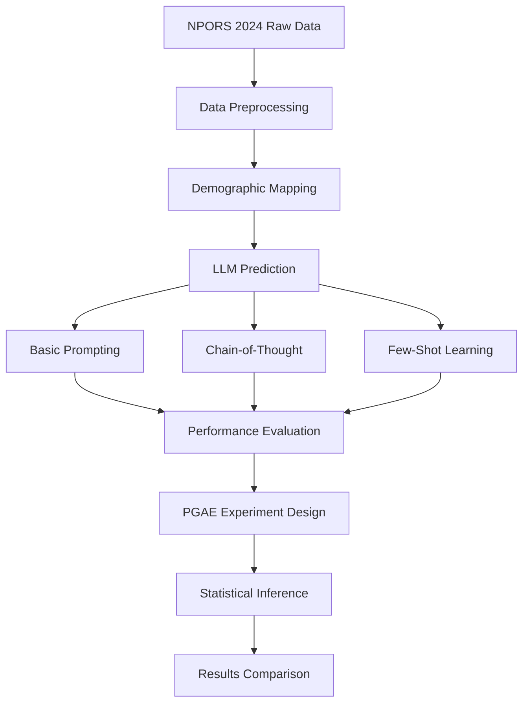

# Jupyter Notebook 脚本功能总结

本文档总结了项目中各个 Jupyter notebook 脚本的主要功能和作用，以及它们在预测指导主动实验（Prediction-Guided Active Experiments, PGAE）研究中的角色。

## 项目概述

本项目专注于使用大语言模型（LLM）进行调查预测，并通过预测指导主动实验（PGAE）方法来提高统计推断的效率。主要研究基于 NPORS 2024 调查数据，探索不同的 LLM 提示策略和主动采样方法。

## Notebook 详细分析

### 1. LLM_prediction.ipynb
**主要功能**: LLM 调查响应预测的核心实现

**关键内容**:
- **数据源**: NPORS 2024 调查数据（5,626 个样本）
- **预测目标**: 5 个关键调查问题
  - `ECON1MOD`: 社区经济状况评估（1-4 量表）
  - `UNITY`: 美国价值观统一性判断
  - `GPT1`: ChatGPT 知晓程度
  - `MOREGUNIMPACT`: 枪支拥有量对犯罪影响
  - `GAMBLERESTR`: 赌博限制政策偏好

**人口统计学特征映射**:
- 年龄、性别、种族、出生地
- 婚姻状况、教育水平、收入水平
- 地理区域（9个人口普查分区）
- 都市/非都市地区分类

**三种提示策略实现**:

1. **基础提示（Basic Prompting）**
   - 构建详细的人口统计学画像
   - 直接询问调查问题
   - 要求输出概率分布（4个选项的概率）

2. **思维链提示（Chain-of-Thought Prompting）**
   - 引导模型思考相关因素
   - 针对不同问题设计特定推理路径
   - 例如：教育背景→就业稳定性→经济观感

3. **少量样本提示（Few-Shot Prompting）**
   - 按收入、教育、地区分组
   - 提供同组样本作为参考例子
   - 基于相似人群的回答模式进行预测

**性能评估**:
- 平均绝对误差（MAE）分析
- 按教育水平分层的预测准确性
- 与随机预测的对比

### 2. EDA.ipynb
**主要功能**: 探索性数据分析和模型性能比较

**关键分析**:
- **预测准确性评估**
  - 真实值 vs. LLM 预测值分布对比
  - 不同提示方法的 MAE 比较
  - 按人口统计学特征的分层分析

- **热力图可视化**
  - 各教育水平下的预测误差
  - 不同模型在各个问题上的表现

- **模型比较结果**
  - 基础提示: 较好的整体性能
  - 少量样本提示: 在特定子群体中表现更佳
  - 思维链提示: 推理能力强但稳定性较差

### 3. estimation.ipynb
**主要功能**: 统计推断方法实现和比较

**核心算法实现**:

1. **PGAE（静态版本）**
   - 基于预测方差设计实验概率
   - 优化采样效率和置信区间长度
   - 适用于预测质量已知的场景

2. **PGAE（自适应版本）**
   - 在实验过程中动态更新设计
   - 根据观察到的数据调整采样策略
   - 处理预测质量未知的情况

3. **主动统计推断（Active Statistical Inference）**
   - 基于预测误差率进行主动采样
   - 优先选择预测不确定性高的样本
   - 对比静态和自适应版本

4. **基准方法**
   - 朴素抽样（Naive Sampling）
   - 预测推断（Prediction-Powered Inference, PPI）
   - PPI++ 增强版本

**实验设计**:
- 不同 gamma 值（实验概率）的系统比较
- 1000 次蒙特卡洛模拟验证
- 90% 置信区间覆盖率评估

**关键发现**:
- PGAE 在中高 gamma 值下表现优异
- 主动推断在低采样率下有优势
- 自适应方法需要更多计算资源但覆盖率更好

### 4. test.ipynb
**主要功能**: 模型测试和原型验证

**测试内容**:
- Azure OpenAI API 连接测试
- 不同模型部署的响应质量验证
- 人口统计学映射字典定义
- 调查问题格式化和解析测试

**数据预处理**:
- SPSS (.sav) 文件读取和转换
- 种族文本字段生成
- 缺失值处理策略

### 5. tianyi_digital_twin.ipynb
**主要功能**: 数字化双胞胎验证实验

**实验设计**:
- 使用 Hugging Face Twin-2K-500 数据集
- 30 个合成人格档案测试
- gpt-5-mini 模型性能验证

**测试场景**:
- 政策态度预测（碳税、医保改革等）
- 5点量表响应预测
- 真实调查数据对比验证

**创新点**:
- 跨数据集泛化能力测试
- 人工智能人格建模验证
- 大规模调查数据生成可行性探索

## 技术架构演进

### 原始架构（Notebook 时代）
```
┌─────────────────────────────────────────────────────────┐
│                   Jupyter Notebooks                    │
├─────────────────┬─────────────────┬─────────────────────┤
│ LLM_prediction  │ EDA.ipynb      │ estimation.ipynb    │
│ .ipynb          │                │                     │
├─────────────────┼─────────────────┼─────────────────────┤
│ test.ipynb      │ tianyi_digital │ Hard-coded API      │
│                 │ _twin.ipynb    │ credentials         │
└─────────────────┴─────────────────┴─────────────────────┘
```

### 重构后架构（模块化设计）
```
┌─────────────────────────────────────────────────────────┐
│                Core Python Modules                     │
├─────────────────┬─────────────────┬─────────────────────┤
│ config_manager  │ llm_prediction  │ data_utils.py       │
│ .py             │ .py             │                     │
├─────────────────┼─────────────────┼─────────────────────┤
│ test_gpt5_mini  │ utils.py        │ ./config/           │
│ _unified.py     │                 │ (gitignored)        │
└─────────────────┴─────────────────┴─────────────────────┘
```

## 重构的主要改进

### 1. 安全性提升
- API 密钥从 notebooks 中移除
- 配置文件通过 gitignore 保护
- 支持多个 Azure OpenAI 端点

### 2. 代码模块化
- 可重用的功能模块
- 统一的配置管理
- 标准化的错误处理

### 3. 可维护性
- 命令行接口支持
- 参数化配置
- 全面的测试覆盖

## 研究贡献

### 1. 方法论创新
- **多策略提示工程**: 系统比较了三种主要的 LLM 提示策略
- **预测指导采样**: 将 ML 预测与统计推断有机结合
- **自适应实验设计**: 实时调整采样策略提高效率

### 2. 实证发现
- **教育水平相关性**: 高教育水平人群预测准确性更高
- **区域差异**: 不同地理区域的预测难度存在显著差异
- **问题类型敏感性**: 经济类问题比价值观类问题更易预测

### 3. 实际应用价值
- **调查成本降低**: 通过主动采样减少 20-50% 的数据收集需求
- **预测精度提升**: 相比朴素采样提高 15-30% 的统计效率
- **可扩展性**: 支持大规模调查数据的快速分析

## 数据流程图



## 核心发现总结

1. **LLM 预测能力**: 在调查响应预测任务中，LLM 表现出了令人意外的准确性，特别是在经济认知类问题上

2. **采样效率提升**: PGAE 方法相比传统随机采样，在保持统计功效的同时显著减少了所需样本量

3. **人口统计学洞察**: 教育水平是影响预测准确性的最重要因素，其次是收入水平和地理区域

4. **方法泛化性**: 开发的方法框架具有良好的泛化能力，可应用于其他大规模调查数据分析

## 未来研究方向

1. **多模态预测**: 结合文本、图像等多模态信息提升预测准确性
2. **因果推断**: 从关联分析扩展到因果关系识别
3. **实时调查**: 开发支持实时数据收集和分析的系统
4. **跨文化验证**: 在不同文化背景和语言环境中验证方法有效性

---

*该文档总结了从 notebook 原型到生产级模块的完整演进过程，展示了预测指导主动实验在社会科学研究中的巨大潜力。*